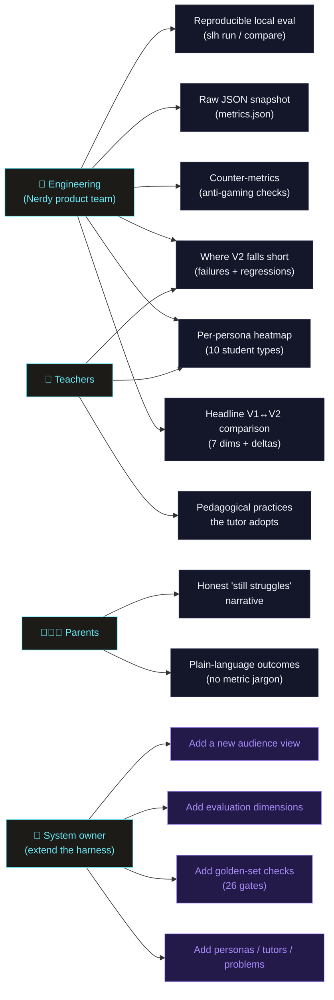
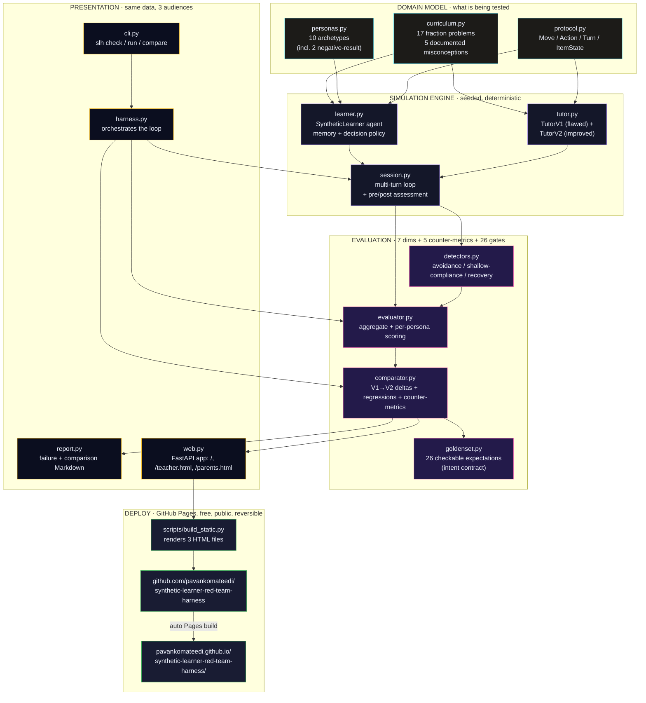
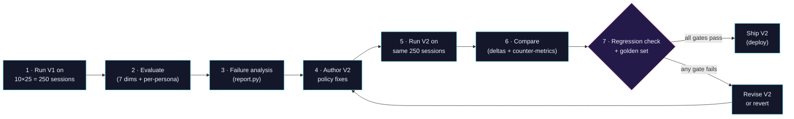

# Architecture & Capability Map — one-pager

> **What this is:** a red-team harness that stress-tests an AI fractions tutor
> with 10 research-grounded synthetic students, surfaces educational failure
> modes, runs one recursive improvement cycle (V1 → V2), and guards against
> benchmark gaming. Fully deterministic (seeded), runs offline, no API key.

---

## Capability map — who can do what

---

## Architecture — modules, data flow, deployment

---

## Module quick-reference

| Module | Responsibility | LOC |
|---|---|---|
| `curriculum.py` | Item bank (instruction / assessment / transfer) + misconception catalog | ~80 |
| `personas.py` | 10 archetypes, each with knowledge / motivation / behavior / memory / avoidance dimensions | ~225 |
| `protocol.py` | Shared types (`Move`, `Action`, `Turn`, `ItemState`, `Transcript`) | ~80 |
| `learner.py` | `SyntheticLearner` per-turn decision engine + memory consolidation | ~175 |
| `tutor.py` | `TutorV1` (flawed baseline) + `TutorV2` (improved) policies | ~165 |
| `session.py` | Multi-turn loop runner + pre/post assessment | ~95 |
| `detectors.py` | Avoidance + shallow-compliance + recovery detection | ~75 |
| `evaluator.py` | 7 PRD §8.1 dimensions, overall + per-persona | ~150 |
| `comparator.py` | V1→V2 deltas, regression check, 5 PRD §8.2 counter-metrics | ~170 |
| `goldenset.py` | 26 checkable expectations (population + comparison + behavior) | ~210 |
| `report.py` | Failure-mode + comparison Markdown renderers | ~125 |
| `harness.py` | Orchestrates the improvement loop | ~40 |
| `web.py` | FastAPI dashboard — 3 audience views (Nerdy / Teachers / Parents) | ~680 |
| `cli.py` | `slh check / run / compare` entrypoint | ~90 |

---

## Quality gates

| Gate | Tool | Target | Current |
|---|---|---|---|
| Lint | `ruff` | clean | ✅ clean |
| Tests | `pytest` | green | ✅ **63 passing** |
| Coverage | `pytest --cov` | ≥ 85 % | ✅ **97.5 %** |
| Golden set | `slh check` | 26/26 | ✅ **26/26** |
| Live URL | `curl` | HTTP 200 | ✅ 200 (×3 pages) |

The golden set is the eval contract — each gate encodes an *intent* that must
keep holding (e.g. *"V2 must withhold answers"*, *"struggling learner must
stay below the transfer threshold — that's intentional"*, *"at least one
honest regression must exist or improvement looks gamed"*). New behaviors
get pinned by adding gates, not by manual review.

---

## Recursive improvement loop

---

## Audience views (one URL each)

| Audience | URL path | Lens | What's surfaced |
|---|---|---|---|
| Engineering (Nerdy) | `/` | technical | All 7 dimensions, counter-metrics, falls-short table, per-persona heatmap, failure modes per tutor |
| Teachers | `/teacher.html` | pedagogical | 3 big stats (answer-handing %, misconception-fix %, recovery %), practices the tutor adopts, falls-short table, persona archetypes |
| Parents | `/parents.html` | outcome | 3 plain stats (types helped / answer-handing / types it can't reach), "What it does well", honest "Where it still struggles" |

---

## Why this design

| Choice | Reason |
|---|---|
| Rule-based agents (no LLM in the loop) | Quality gates must be deterministic; PRD §10.2 permits it; failures must be reproducible to be falsifiable |
| Static export to GitHub Pages | Dashboard is fully deterministic — same numbers every run — so a static snapshot is identical to the live FastAPI server, at zero cost |
| Three audience views | Same harness data, three lenses — different vocabulary serves different decision-makers |
| Two intentional negative-result personas | Avoids "all positive results" theater; pins honest failures into the golden set so future changes can't quietly hide them |
| Golden-set checks live in code, not prose | Continuous-improvement requires re-checking against the contract on every change — code is re-runnable, prose decays |
